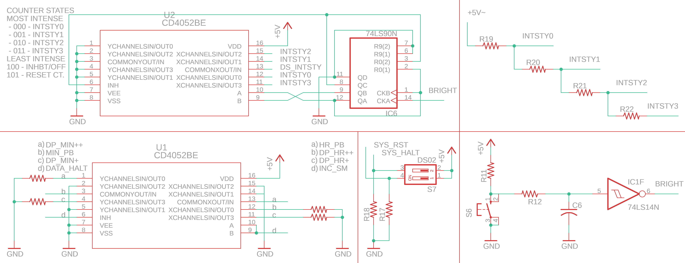
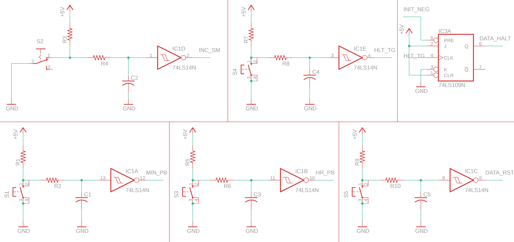
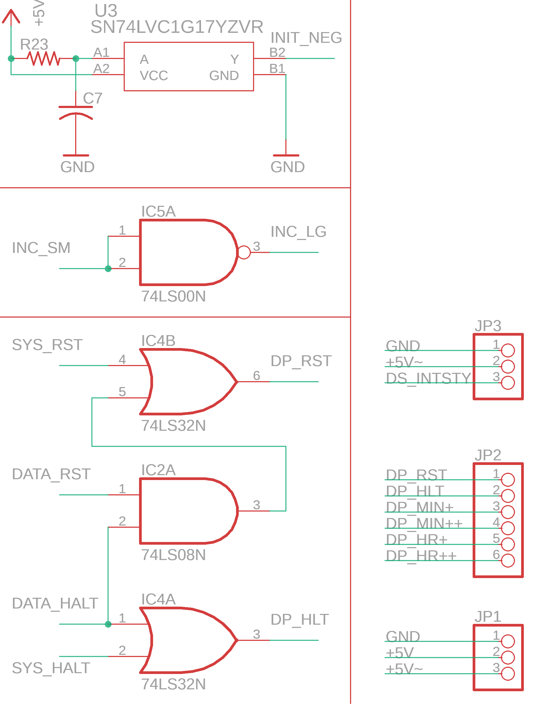
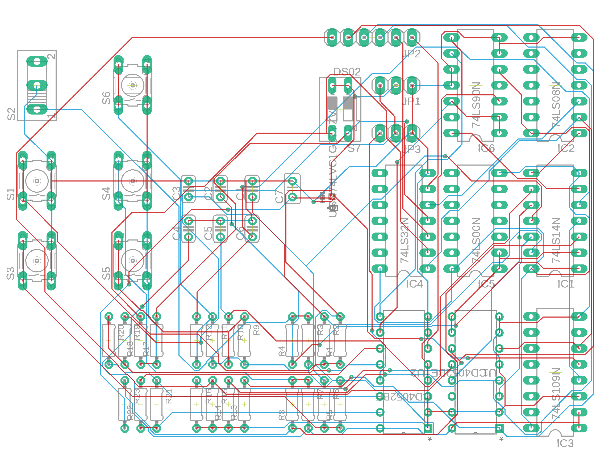

# Clock Control

## EAGLE Project, Revision 1*
## Quartus files currently unavailable for this Project.

---

## Schematics

---

---

---

## Boards

---

## Board Inputs:

| Input Name | Input from Board | Output on Board |
| --- | --- | --- |
| +5V | Power | 5V |
| +5V~ | Power | 5V~ |
| GND | Power | GND |

---

## Board Outputs:

| Output Name | Output to Board | Input on Board |
| --- | --- | --- |
| DP_RST | Datapath | RST |
| DP_HLT | Datapath | HALT |
| DP_MIN+ | Datapath | ADD_MIN |
| DP_MIN++ | Datapath | ADD_MIN_LG |
| DP_HR+ | Datapath | ADD_HR |
| DP_HR++ | Datapath | ADD_HR_LG |
| DS_INTSTY | Display | INTSTY |
| +5V~ | Display | +5V |
| GND | Display | GND |

---

## TODO/Goals:
- [x] Brightness Control?
- [x] Debounce Inputs
- [ ] Add connectors/offload switches to daughterboard

---

## Components:

- To be updated soon

---

README revised 6/16/2020

