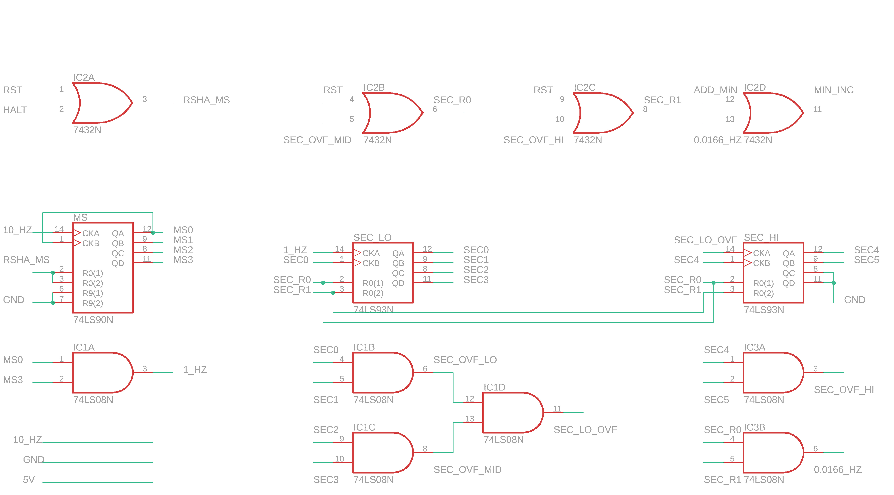
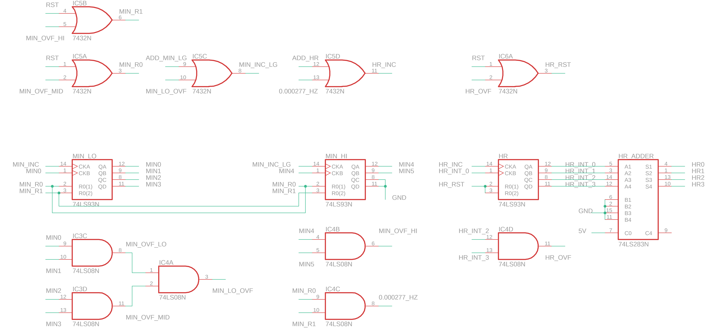
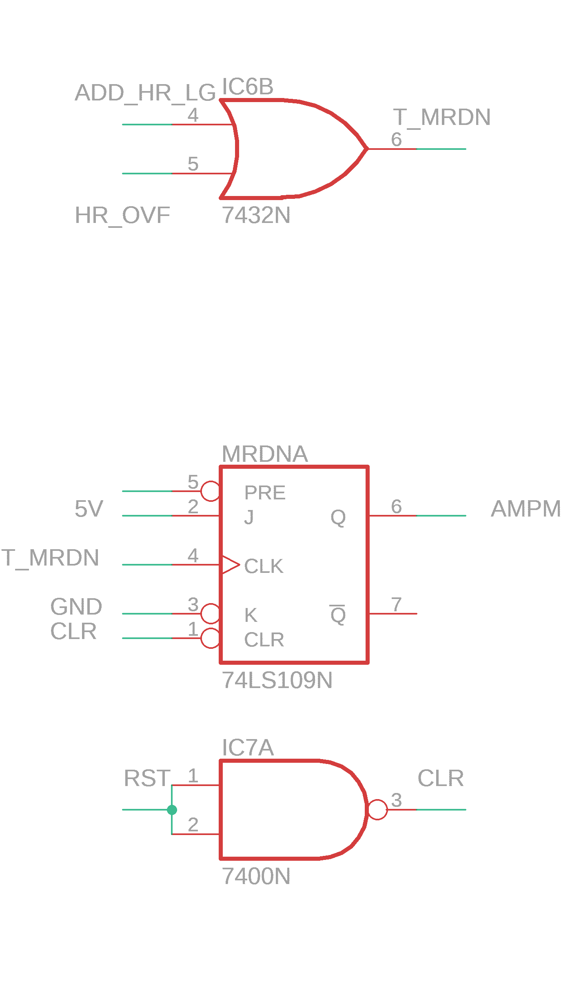
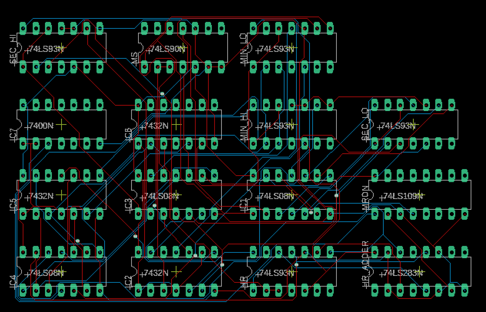

# Clock Datapath

## *EAGLE Project, Revision 2*
## [View Quartus Files](https://github.com/keelbeelveel/binary_clock/tree/master/quartusII/datapath2.1)

---

## Schematics:

---

---

---

## Boards - **WORKING**

---

## Board Inputs:

| Input Name | Input From Board | Output on Board |
| --- | --- | --- |
| 5V | Power | |
| GND | Power | |
| 10_HZ | Power | |
| RST | Control | |
| HALT | Control | |
| ADD_MIN | Control | |
| ADD_MIN_LG | Control | |
| ADD_HR | Control | |
| ADD_HR_LG | Control | |

---

## Board Outputs:

| Output Name | Output to Board | Input on Board |
| --- | --- | --- |
| MS[0:3] | Display | |
| SEC[0:5] | Display | |
| MIN[0:5] | Display | |
| HR[0:3] | Display | |
| AMPM | Display | |

---

## TODO/Goals:

---

## Components:
- 1/4x 7400N (NAND)
- 3x 74LS08N (AND)
- 3x 7432N (OR)
- 1x 74LS90N (Decade Counter)
- 5x 74LS93N (Hexadecimal Counter)
- 1/2x 74LS109N (JKFF)
- 1x 74LS283N (Adder)

---

README revised 6/15/2020
